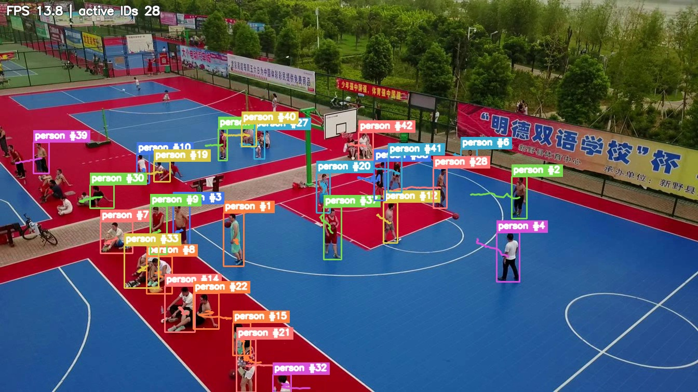
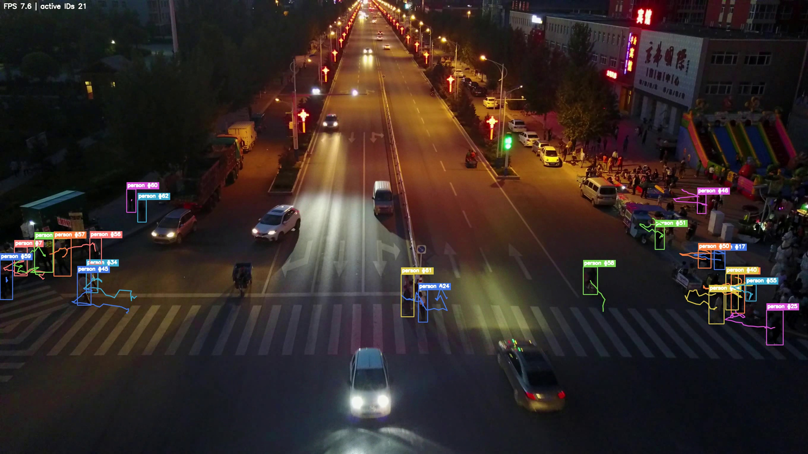
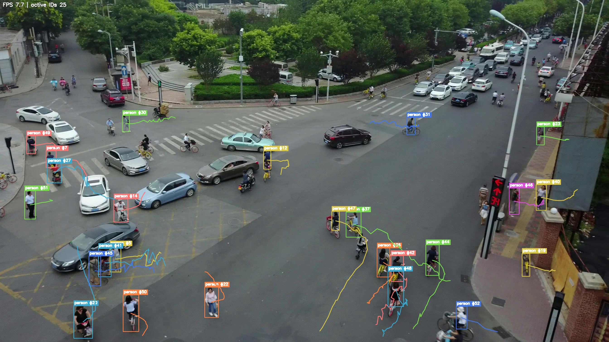
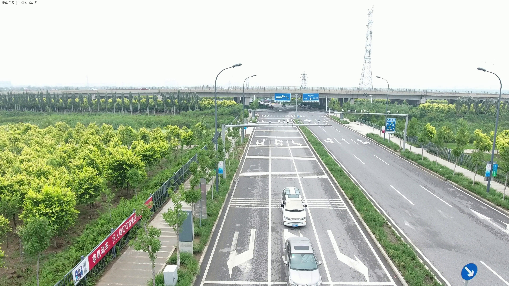

# VisDrone Person MOT Submission


A lightweight person detection and multi-object tracking pipeline for the
VisDrone 2019 MOT validation set. The submission detects people in moving drone
footage, assigns stable track IDs, and renders annotated videos with bounding
boxes, IDs, trajectory tails, and FPS overlays.

The repository keeps the code, configuration, benchmark summaries, and visual
previews in Git. The full original submission archive is attached to the
[`v1.0.0` release](https://github.com/NeuTriNos0911/visdrone-person-mot-submission/releases/tag/v1.0.0).

## Preview

| Sequence | Preview |
|---|---|
| `uav0000086_00000_v` |  |
| `uav0000117_02622_v` |  |
| `uav0000137_00458_v` |  |
| `uav0000268_05773_v` |  |

## Highlights

- Compact `yolo11n.pt` detector, only **5.61 MB**, far below the 300 MB model
  budget.
- Person-only VisDrone conversion that merges `pedestrian` and `people` into
  one `person` class.
- ByteTrack-inspired association with high-confidence track creation and
  low-confidence recovery.
- Sparse optical-flow camera-motion compensation for moving-drone footage.
- Full validation benchmark across all 7 VisDrone MOT validation sequences.
- Edge-oriented path for ONNX/TensorRT export and Jetson deployment.

## Results

| Sequence | Frames | FPS | JSON |
|---|---:|---:|---|
| `uav0000086_00000_v` | 464 | 11.990 | [`json`](results/full_validation/uav0000086_00000_v.json) |
| `uav0000117_02622_v` | 349 | 7.553 | [`json`](results/full_validation/uav0000117_02622_v.json) |
| `uav0000137_00458_v` | 233 | 7.680 | [`json`](results/full_validation/uav0000137_00458_v.json) |
| `uav0000182_00000_v` | 363 | 14.382 | [`json`](results/full_validation/uav0000182_00000_v.json) |
| `uav0000268_05773_v` | 978 | 5.170 | [`json`](results/full_validation/uav0000268_05773_v.json) |
| `uav0000305_00000_v` | 184 | 9.560 | [`json`](results/full_validation/uav0000305_00000_v.json) |
| `uav0000339_00001_v` | 275 | 11.050 | [`json`](results/full_validation/uav0000339_00001_v.json) |

Overall benchmark:

```text
Total frames: 2,846
Total processing time: 373.7842 seconds
Overall FPS: 7.614
```

## Repository Layout

```text
configs/                 Runtime and dataset configuration
src/drone_person_mot/    Detector, tracker, camera-motion, visualization code
tools/                   Dataset, training, inference, and export scripts
tests/                   Lightweight tests for conversion and tracking logic
results/full_validation/ JSON metrics and preview frames
yolo11n.pt               Compact detector used for the submitted run
SUBMISSION_REPORT.md     Method, results, and deployment notes
ATTRIBUTION.md           Dataset, model, and library attribution
```

The rendered validation MP4 files are intentionally distributed through the
GitHub release asset instead of normal Git history because several videos are
larger than GitHub's regular file limit.

## Download The Full Submission

Download the original archive from the release page:

```text
VisDrone_Person_MOT_Submission.zip
```

Release URL:

```text
https://github.com/NeuTriNos0911/visdrone-person-mot-submission/releases/tag/v1.0.0
```

## Quickstart

Create a virtual environment and install the package:

```powershell
python -m venv .venv
.\.venv\Scripts\Activate.ps1
python -m pip install --upgrade pip
python -m pip install -e .
```

Run the tracker on a sequence:

```powershell
python tools/run_person_tracker.py `
  --source path\to\VisDrone2019-MOT-val\sequences\uav0000086_00000_v `
  --output results\demo.mp4 `
  --weights yolo11n.pt `
  --imgsz 960 `
  --conf 0.08
```

Run tests:

```powershell
python -m pytest
```

## Method

The pipeline follows a practical edge-first design:

1. Run YOLO11n person detection at a higher input size for small aerial targets.
2. Estimate global camera motion between frames using sparse optical flow.
3. Predict active track locations with velocity and camera-motion compensation.
4. Match detections with IOU in two passes: high-confidence updates first,
   low-confidence recovery second.
5. Keep unmatched tracks alive briefly to bridge occlusion and missed detections.
6. Render annotated MP4 outputs with stable IDs and recent trajectory tails.

See [`SUBMISSION_REPORT.md`](SUBMISSION_REPORT.md) for the full technical
write-up, hardware notes, limitations, and edge deployment plan.

## Attribution

This project uses the VisDrone dataset format, Ultralytics YOLO weights, OpenCV,
PyTorch, NumPy, Pillow, PyYAML, and tqdm. See [`ATTRIBUTION.md`](ATTRIBUTION.md)
for details.
